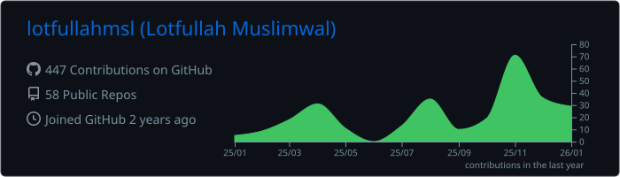
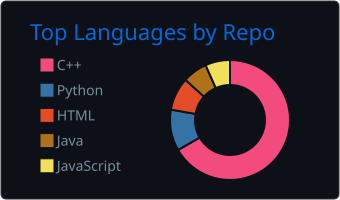
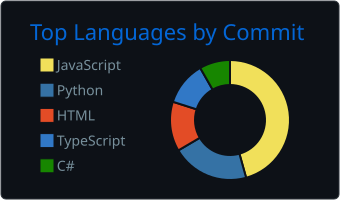
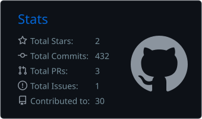
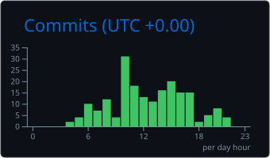

<!--
GitHub Profile — Lotfullah Muslimwal (@lotfullahmsl)
Design goals: dark • professional • animated • signal‑driven • readable at a glance
This is a special profile README (repo name = username).
-->

<!-- Header: animated wave banner -->
<p align="center">
	
</p>

<!-- Animated type intro -->
<p align="left">
	
</p>

<!-- Quick badges (dark accents) -->
<p align="left">
	<a href="https://github.com/lotfullahmsl?tab=followers" title="Followers">
		
	</a>
	<a href="https://github.com/lotfullahmsl" title="Stars">
		
	</a>
	
</p>


## About

- Systems‑minded software engineer with a focus on fundamentals and clarity.
- I build small, composable units that scale into reliable systems.
- I prefer explainable code, explicit invariants, and boring reliability over novelty.
- I optimize for learning rate, leverage, and user outcomes.

## Operating Principles

- Signal over noise — measure outcomes, not aesthetics.
- Simplicity scales — remove accidental complexity before adding capability.
- Correctness first — invariants explicit, tests close to logic.
- Mechanical sympathy — choose data and boundaries that fit the problem.
- Write to explain — make intent obvious in code and docs.
- Document decisions — context beats folklore; ADRs when decisions matter.
- Prefer composition over inheritance — small parts, stable interfaces.
- Fail fast at boundaries — validate, sanitize, observe.
- Bias to automation — tests, CI, and reproducible environments.
- Maintain momentum — consistent, incremental improvement beats sporadic heroics.

## Now / Next

- Deepening CS foundations (systems, algorithms, distributed trade‑offs)
- Building durable tools that compose into larger capabilities
- Practicing deliberate refactoring and incremental design
- Capturing reasoning in lightweight docs and ADRs

---

## Expertise

- Languages: Python, TypeScript/JavaScript
- Backend: Node.js, FastAPI/Flask, REST/gRPC fundamentals
- Frontend: React, minimal state, typed APIs
- Systems: Docker, Linux, shell, basic k8s ergonomics
- Data: modeling, migrations, indexing, cache strategies
- Testing: property‑based where useful, fast unit tests near logic
- Observability: logs/metrics/traces with simple SLOs

---

## Signals (Dark)

<!-- Activity stats (dark) -->
<p align="left">
	
</p>

<!-- Languages (dark) -->
<p align="left">
	
</p>

<!-- Streak (dark) -->
<p align="left">
	
</p>

<!-- Contribution graph (dark, collapsible) -->
<details>
	<summary>Contribution Graph (dark)</summary>
	<p>
		
	</p>
</details>

<!-- Locally generated contribution snake (dark/light) -->
<p>
	<picture>
		<source media="(prefers-color-scheme: dark)" srcset="./output/github-contribution-grid-snake-dark.svg" />
		<source media="(prefers-color-scheme: light)" srcset="./output/github-contribution-grid-snake.svg" />
		
	</picture>
</p>

<sub>Signals describe progress; they don’t define it. If any external card fails to load, local images (snake, summary cards) keep the page reliable.</sub>

---

## Selected Notes (Architecture)

<details open>
	<summary>Boundaries and data flow</summary>

	A pragmatic structure that keeps complexity where it belongs:

```text
app/
	domain/            # entities, invariants, domain services
	usecases/          # orchestration & policies
	adapters/          # db, http, queues (ports/adapters)
	entrypoints/       # cli, http handlers, workers
	support/           # config, logging, observability
```

Key rules:
- Domain is pure and framework‑agnostic.
- Use cases orchestrate; they don’t know transport or storage details.
- Adapters translate between external systems and domain/use cases.
- Entrypoints are thin; they glue transport to use cases.

</details>

<details>
	<summary>Data modeling and evolution</summary>

Start with reads and invariants, then design writes.

```sql
-- Users and sessions (minimal, indexed)
create table users (
	id bigserial primary key,
	email text unique not null,
	created_at timestamptz not null default now()
);

create table sessions (
	id bigserial primary key,
	user_id bigint not null references users(id),
	expires_at timestamptz not null,
	created_at timestamptz not null default now()
);

create index on sessions (user_id);
create index on sessions (expires_at);
```

Principles:
- Model for the questions you ask most frequently.
- Prefer explicit foreign keys; add indexes from first read profile.
- Use events (or change tables) for downstream async projections.

</details>

<details>
	<summary>Performance budgets</summary>

Think in budgets to prevent accidental slow paths.

```text
API p99 latency: 250 ms budget
	- auth (token check):         5–10 ms
	- validation:                 2–5 ms
	- primary query (indexed):   20–60 ms
	- compute/transform:         5–20 ms
	- serialization/network:    10–30 ms
Observability sampling: 5–10% traces on hot paths until stable.
```

Actions:
- Add tracing to boundary layers first.
- Measure, then refactor tight loops and allocations.
- Cache only with explicit invalidation signals.

</details>

<details>
	<summary>Fault tolerance patterns</summary>

Pragmatic patterns that keep systems calm under stress.

```text
• Circuit breakers at integration points
• Timeouts per call path; never rely on defaults
• Bounded queues and backpressure, avoid unbounded fan‑out
• Idempotency keys for retried writes
• Dead‑letter queues with clear retention policies
• Graceful degradation: partial features over total failure
```

</details>

---

## Toolbox

<p>
	
	
	
	
	
	
	
	
</p>

<sub>I pick tools for the problem, not the other way around.</sub>

---

## Summary Cards (Local, dark)

<details open>
	<summary>Profile details</summary>
	<p>
		
	</p>
</details>

<details>
	<summary>Repos • Commits • Languages</summary>
	<p>
		
		
		
		
	</p>
</details>

---

## Reading & Writing

Recent interests: systems thinking, DDD lite, operational excellence, strategy.

Selected reads:
- Designing Data‑Intensive Applications — Kleppmann
- The Pragmatic Programmer — Hunt & Thomas
- A Philosophy of Software Design — Ousterhout
- Site Reliability Engineering — Beyer et al.

Notes and posts live off‑platform; I keep GitHub technical.

---

## Links

- Website: <a href="https://lotfullahmsl.com/" target="_blank">lotfullahmsl.com</a>
- LinkedIn: <a href="https://www.linkedin.com/in/lotfullahmsl/" target="_blank">/in/lotfullahmsl</a>

---

## Colophon

- Typing: <a href="https://github.com/DenverCoder1/readme-typing-svg" target="_blank">readme‑typing‑svg</a>
- Stats: <a href="https://github.com/anuraghazra/github-readme-stats" target="_blank">github‑readme‑stats</a>
- Streak: <a href="https://github.com/DenverCoder1/github-readme-streak-stats" target="_blank">streak‑stats</a>
- Activity graph: <a href="https://github.com/Ashutosh00710/github-readme-activity-graph" target="_blank">activity‑graph</a>
- Snake: <a href="https://github.com/Platane/snk" target="_blank">snk</a>
- Summary cards: <a href="https://github.com/vn7n24fzkq/github-profile-summary-cards" target="_blank">profile‑summary‑cards</a>

<p align="center">
	
</p>

